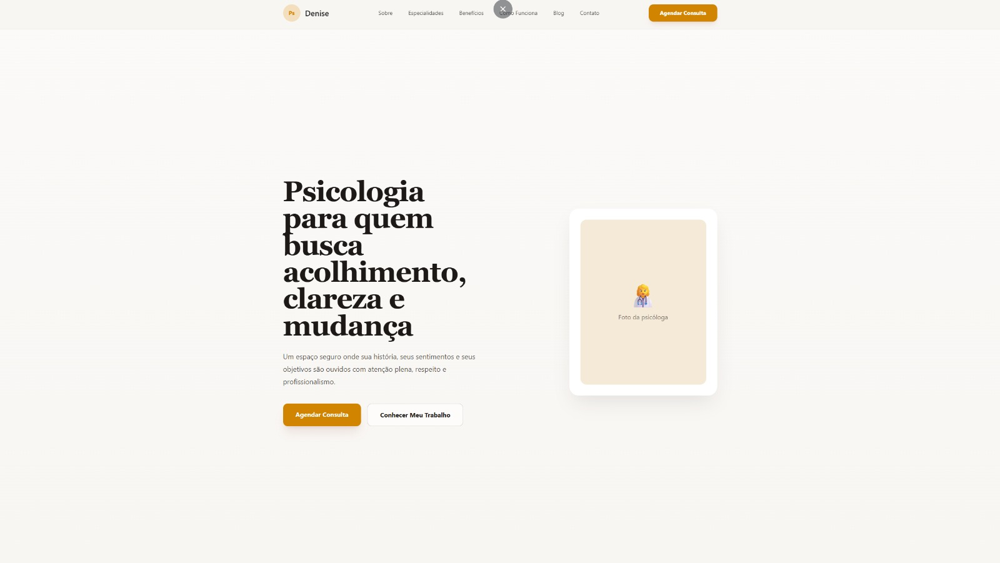

# Psicóloga Premium Landing Page

Uma landing page moderna, elegante e sofisticada desenvolvida para uma psicóloga profissional, com foco em acolhimento, presença digital, credibilidade e conversão de visitantes em pacientes.

O projeto foi criado utilizando tecnologias modernas do ecossistema Front-End, priorizando performance, experiência do usuário, responsividade e design premium inspirado em sites de clínicas e profissionais de alto padrão.

---

## Preview

🔗 Deploy Online  
https://portfolio-psicologa-mu.vercel.app/

---

## Preview Visual



---

## Tecnologias Utilizadas

- React
- Vite
- TypeScript
- TailwindCSS
- Framer Motion
- Lenis Smooth Scroll
- Lucide React
- HTML5
- CSS3

---

## Principais Funcionalidades

✨ Layout moderno e premium  
✨ Interface totalmente responsiva  
✨ Scroll suave com Lenis  
✨ Animações refinadas com Framer Motion  
✨ Hero Section profissional  
✨ Sessão “Sobre” elegante  
✨ Área de especialidades  
✨ Benefícios do acompanhamento terapêutico  
✨ Timeline explicativa do processo terapêutico  
✨ Sessão de blog  
✨ Formulário funcional de contato  
✨ Integração com WhatsApp  
✨ Estrutura componentizada  
✨ Experiência otimizada para mobile  
✨ Código limpo e escalável  

---

## Objetivo do Projeto

Este projeto foi desenvolvido como parte do meu portfólio profissional, simulando uma landing page premium para psicólogos e clínicas modernas.

O objetivo principal foi criar uma experiência visual sofisticada e acolhedora, transmitindo profissionalismo, confiança e conforto ao visitante.

---

## Estrutura do Projeto

```bash
src/
 ├── assets/
 ├── components/
 ├── sections/
 ├── App.tsx
 ├── main.tsx
 └── index.css
```

---

## Como Executar Localmente

Clone o repositório:

```bash
git clone https://github.com/devbyenzo/portfolio_psicologa.git
```

Acesse a pasta do projeto:

```bash
cd portfolio_psicologa
```

Instale as dependências:

```bash
npm install
```

Execute o projeto:

```bash
npm run dev
```

---

## Performance e Experiência

O projeto foi desenvolvido priorizando:

- Performance otimizada
- Responsividade avançada
- Experiência fluida
- Navegação intuitiva
- Visual minimalista premium
- Animações suaves
- Organização escalável do código

---

## Autor

Desenvolvido por Enzo

GitHub:  
https://github.com/devbyenzo

---

## Licença

Este projeto está sob a licença MIT.
